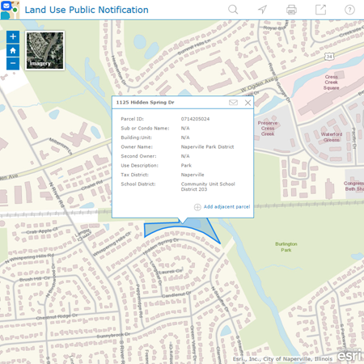

# land-use-public-notification

***This land use public notification repo has been replaced by the ArcGIS for Web AppBuilder [Public Notification](https://doc.arcgis.com/en/web-appbuilder/create-apps/widget-public-notification.htm) widget, applications built from this repo are in mature support.***

***Check out the new [Public Notification](http://solutions.arcgis.com/local-government/help/public-notifications/) solution***

Public Notification (previously known as Land Use Public Notification) is a configuration of ArcGIS Server and a JavaScript application that allows local government staff to identify properties within a given distance (buffer) of a subject property and generate mailing labels and/or a structured text file of owners and occupants that fall within the buffer. This application is typically used by local planning and zoning officials, but can be used by any agency looking to notify property owners and occupants of a formal action being taken.

## Features

* Find a specific parcel or road
* Buffer a parcel or road based on a given distance
* Generate mailing labels in PDF or CSV formats
* Print a map of the buffer

## Requirements

**Start now using Esri-supplied sample services**

You can start using the application now by setting it up on a web server running Microsoft Internet Information Services (IIS) and using sample services supplied by Esri.
You'll need to convert to an application in IIS and use the ASP .NET 4.0. application pool.

**Start now using your own services**

For more information on requirements and publication steps, see [Public Notification](http://links.esri.com/localgovernment/help/PublicNotification) help.

## Resources

Additional [information and sample data](http://links.esri.com/localgovernment/download/publicnotification) are available for the application.

Learn more about Esri's [ArcGIS for Local Government maps and apps](http://solutions.arcgis.com/local-government/).

Show me a list of other [Local Government GitHub repositories](http://esri.github.io/#Local-Government).

This application uses the 3.15 version of [Esri's ArcGIS API for JavaScript](http://help.arcgis.com/en/webapi/javascript/arcgis/); see the site for concepts, samples, and a reference for using the API to create mapping web sites.

[New to Github? Get started here.](http://htmlpreview.github.com/?https://github.com/Esri/esri.github.com/blob/master/help/esri-getting-to-know-github.html)

## Issues

Find a bug or want to request a new feature?  Please let us know by submitting an issue.

## Contributing

Esri welcomes contributions from anyone and everyone.
Please see our [guidelines for contributing](https://github.com/esri/contributing).

## Licensing

Copyright 2013 Esri

Licensed under the Apache License, Version 2.0 (the "License");
you may not use this file except in compliance with the License.
You may obtain a copy of the License at

   http://www.apache.org/licenses/LICENSE-2.0

Unless required by applicable law or agreed to in writing, software
distributed under the License is distributed on an "AS IS" BASIS,
WITHOUT WARRANTIES OR CONDITIONS OF ANY KIND, either express or implied.
See the License for the specific language governing permissions and
limitations under the License.

A copy of the license is available in the repository's
[LICENSE.txt](LICENSE.txt) file.
